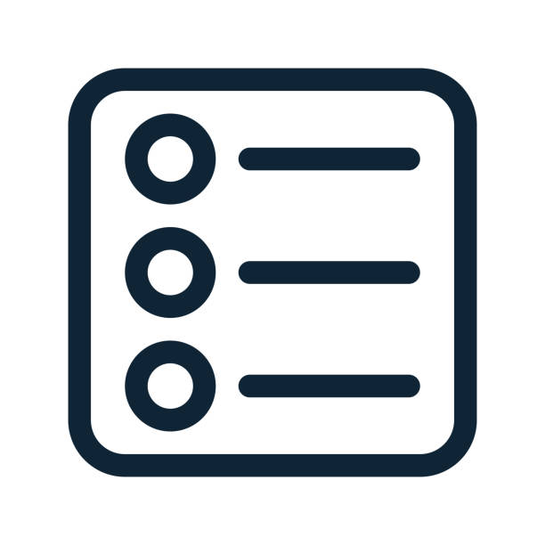

 

  <h1 align="center">Twinficient</h1>
  
  

    <a href="https://github.com/Green-AI-Hub-Mittelstand/readme_template/issues">Report Bug</a>
    ·
    <a href="https://github.com/Green-AI-Hub-Mittelstand/readme_template/issues">Request Feature</a>
  

   

  

    
     
    <h3 align="center"><strong>Green-AI Hub Mittelstand</strong></h3>
    <a href="https://www.green-ai-hub.de"><u>Homepage</u></a> 
    | 
    <a href="https://www.green-ai-hub.de/kontakt"><u>Contact</u></a>
  
   
  

 

## About The Project
AI-based configuration of heating systems
 
KÜBLER manufactures systems heat halls in a particularly energy-efficient manner. The portfolio is supplemented by device variants with lighting, cooling and ventilation concepts as well as thermal-supported heating. 3D models of the halls are used for planning to ensure efficient use of the heating systems.
The pilot project TwinFicient of the Green-AI Hub Mittelstand links the different information for the first time via a digital twin. A dashboard allows the analysis of the data, which enables enormous savings potential for future systems by revealing oversizing and optimizing the technical coordination of individual system components. The digital twin is supplemented by mixed reality glasses that visualize the heating device in a factory hall or warehouse. This allows planned installations to be visually checked in advance on site, e.g. in an assembly hall, in order to identify the most suitable installation of the hall heating systems based on empirical values and visual feedback.

(<a href="#readme-top">back to top</a>)

## Table of Contents

  

  <ol>
    <li>
      <a href="#about-the-project">About The Project</a>
    </li>
    <li><a href="#table-of-contents">Table of Contents</a></li>
    <li>
      <a href="#getting-started">Getting Started</a>
      <ul>
        <li><a href="#prerequisites">Prerequisites</a></li>
        <li><a href="#installation">Installation</a></li>
      </ul>
    </li>
    <li><a href="#usage">Useful tools</a></li>
    <li><a href="#contributing">Contributing</a></li>
    <li><a href="#license">License</a></li>
    <li><a href="#contact">Contact</a></li>
  </ol>

(<a href="#readme-top">back to top</a>)

## Getting Started

Clone this repository, navigate with your terminal into this repository and execute the following steps.

(<a href="#readme-top">back to top</a>)

### Prerequisites

Set up the docker stack as described in the [docker folder readme file](./docker/README.md).

It is required that you install the [influx CLI](https://docs.influxdata.com/influxdb/cloud/reference/cli/influx/) and run *init-influx.sh* (For now it works on the host machine by accesing localhost). Adjust the server settting in the script, if you are not running Influx on your machine.

(<a href="#readme-top">back to top</a>)

### Installation

To migrate metrics from the SQLite database to InfluxDB follow [these instructions](./telegraf/README.md).

When the docker instances are up and running, import bucket data as described [here](./backup/README.md). You need to provide the data previously and store it in your repository to share it with your collegues.

Check out the template script for importing influx db related components [here](./templates/README.md). 

(<a href="#readme-top">back to top</a>)

## Useful tools

The following tools, or part of them, could be useful for your projects.

- shell scripts that are contained in the subfolders
    - expecially the [tool to extract aasx files](./aasx/README.md)
- [docker-stack that](./docker/README.md) could be adapted for your needs
- [data-integration tool](./services/data-integration/README.md)
    - useful for task aggregation
- [digital-twin-initializer](./services/digital-twin-initializer/README.md)
    - useful to define digital twins in a simple format like csv and let them be converted and deployed by the tool
    - it also keeps the csv and the server-side resources in sync
- [basyx-java-clients](./services/basyx-java-clients/) 
    - java client to interact with [V3 digital twin services](https://github.com/admin-shell-io/aas-specs-api) defined by the IDTA
- [validation tool](./scripts/validate-aas/README.md) for aasx files
- [dashboard component](./docker/config/observability/) that are registered in the docker stack
- [telegraf example](./telegraf/README.md) that illustrates how telegraf can also be used to perform data import.

(<a href="#readme-top">back to top</a>)

## Contributing

Contributions are what make the open source community such an amazing place to learn, inspire, and create. Any contributions you make are **greatly appreciated**.

If you have a suggestion that would make this better, please fork the repo and create a pull request. You can also simply open an issue with the tag "enhancement".
Don't forget to give the project a star! Thanks again!

1. Fork the Project
2. Create your Feature Branch (`git checkout -b feature/AmazingFeature`)
3. Commit your Changes (`git commit -m 'Add some AmazingFeature'`)
4. Push to the Branch (`git push origin feature/AmazingFeature`)
5. Open a Pull Request

(<a href="#readme-top">back to top</a>)

## License

Distributed under the MIT License. See `LICENSE.txt` for more information.

Check third party licenses in the following java projects:

- [validate-aas](./scripts/validate-aas/THIRD-PARTY.txt)
- [basyx-java-clients](./services/basyx-java-clients/THIRD-PARTY.txt)
- [data-integration](./services/data-integration/THIRD-PARTY.txt)
- [digital-twin-initializer](./services/digital-twin-initializer/THIRD-PARTY.txt)

In the docker stack, the components are just used as services. As a hint, we listed the licenses here:

|Image|Licence|
|---|---|
|portainer/portainer-ce:2.18.2|Zlib|
|nginxproxy/nginx-proxy:1.3.1-alpine|MIT|
|influxdb:2.7.4 | Apache-2.0, MIT |
|dfkibasys/aas-registry-dotaas-part2-log-mem|MIT|
|dfkibasys/aas-server|EPL-1.0|
|dfkibasys/ppr-dashboard|EPLv2|
|mongo:7.0.5-jammy|SSPL v1.0|
|eclipsebasyx/aas-registry-log-mongodb|MIT|
|eclipsebasyx/submodel-registry-log-mongodb|MIT|
|eclipsebasyx/aas-environment|MIT|
|eclipsebasyx/aas-gui|MIT|
|grafana/grafana:9.3.16|AGPL-3.0|
|prom/node-exporter:v1.6.0|Apache-2.0|
|gcr.io/cadvisor/cadvisor:v0.47.2|Apache-2.0|
|prom/prometheus:v2.45.0|Apache-2.0|
|grafana/loki:2.8.0|AGPL-3.0|
|grafana/promtail:2.8.0|AGPL-3.0|

(<a href="#readme-top">back to top</a>)

## Contact

Green-AI Hub Mittelstand - info@green-ai-hub.de

Project Link: https://github.com/Green-AI-Hub-Mittelstand/repository_name

 
  <a href="https://www.green-ai-hub.de/kontakt"><strong>Get in touch »</strong></a>
 
 

    

(<a href="#readme-top">back to top</a>)

